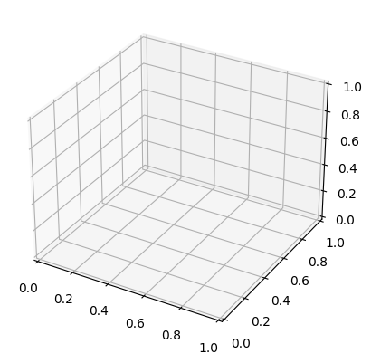
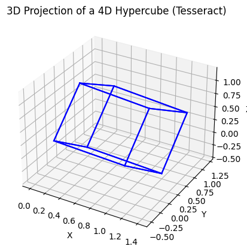

# **Journey into the Unseen: Unveiling the 4th Dimension with Python Magic - Visualizing the Enigmatic Hypercube (Tesseract)**

## A Mind-Blowing Adventure!

Hey there, fellow explorer of the cosmic unknown! 🚀 Have you ever gazed at the stars, pondering the mysteries of the universe, and wondered if there's more than meets the eye? Well, hold onto your hats (or should I say space helmets?) because we're about to dive headfirst into the mind-bending world of the fourth dimension! 🌌✨

Picture this: you're cruising through the vast expanse of space, minding your own business, when suddenly, you stumble upon a realm beyond your wildest dreams. It's like stepping into an alternate reality where the rules of physics take on a whole new meaning. Welcome to the realm of the hypercube, also known as the tesseract! 🌀🔮

Now, I know what you're thinking. How on earth (or should I say, how in the cosmos) can we possibly wrap our minds around such a mind-bending concept? Fear not, intrepid traveler, for we are armed with the most powerful tool in the universe: Python! 🐍💻 With just a few lines of code, we can summon forth this enigmatic shape from the depths of the fourth dimension and bring it to life right before our eyes. Are you ready to embark on this epic journey into the unknown? 🌠

So buckle up, strap on your imagination goggles, and prepare to have your mind blown as we venture into the uncharted territories of the fourth dimension. It's going to be a wild ride, filled with twists, turns, and plenty of mind-bending revelations. Let's fire up our Python engines and set sail into the great unknown! 🚀🔥

## So, what’s the deal with dimensions?

- **1D (One Dimension)**: Yo, check this out, we're talking about the OG, the one-dimensional world. Picture this: it's like that super sleek, skinny line that's just chilling there. You know, like a strand of angel hair pasta, or even cooler, like a ribbon dancing in the wind. It's all about that length, but ain't got no time for width or height, just straight vibin' in its own lane. 🍝

- **2D (Two Dimensions)**: Alright, so we're leveling up now, stepping into the two-dimensional realm. Imagine taking that line and giving it a little stretch, like you're pulling some sweet taffy. Boom, now it's a square, rockin' that length and width, like a canvas waiting for your artistic masterpiece. Think about doodling your favorite cartoon character, bringing them to life in this rad 2D world. 🖍️

- **3D (Three Dimensions)**: Whoa, hold up, we're going full-on three-dimensional now, stacking up those squares and turning them into cubes. It's like building skyscrapers in the city of dimensions. We're talking length, width, and height, the whole shebang. Think about your toy blocks, stacking 'em up to create epic structures that defy gravity. 🧊 But hey, it's not just about stacking blocks, it's about crafting a whole universe in 3D, where anything is possible. 🌌

But what if I told you there’s a whole other dimension beyond these? Yup, we’re talking about the **4th dimension**! 🤯 This mind-bending concept is where we meet the hypercube, also known as a tesseract. Ready to join me on this epic journey into the 4th dimension? Buckle up, because we’re about to visualize this wild shape using Python! 🐍✨ Let’s get started!

# Understanding Dimensions

Alright, team, let's break down the concept of dimensions in a super fun and simple way! 🎉

- **1D (One Dimension)**

Imagine a straight line. It's got length but no width or height. It's like a single, super-thin piece of spaghetti. 🍝

**Real-Life Example**: Think of a tightrope. You can only move forward or backward on it.

- **2D (Two Dimensions)**

Now, take that line and stretch it sideways to make a square. It’s got length and width. Picture drawing your favorite cartoon character on a piece of paper. 🖍️

**Real-Life Example**: Your drawing on paper. You can move up, down, left, or right.

- **3D (Three Dimensions)**

Stack a bunch of those squares to build a cube. Now we’ve got length, width, and height. Think of your toy blocks or a Rubik's cube. 🧊

**Real-Life Example**: A cube of ice. You can move in any direction: up, down, left, right, forward, or backward.

- **4D (Four Dimensions)**

Whoa, what now? The 4th dimension is like adding another direction to your 3D cube. Imagine if your cube could move in a completely new direction that we can’t even see. 🤯 It’s hard to visualize, but think of it as a shadow of a shadow. This extra direction gives us a hypercube or tesseract.

**Real-Life Example**: Imagine your 3D cube can also move in a way we can’t see. It’s like magic! 🎩✨

So, a hypercube is just a cube extended into the 4th dimension. It's got 16 corners, 32 edges, 24 square faces, and 8 cubical cells. Crazy, right? But don't worry, we're going to make this mind-bending concept come to life with some Python magic! 🐍✨

Are you excited? Because I sure am! Let's dive into this awesome journey of visualizing a 4D hypercube! 🚀

x# **Dimensions: The Basics**

Alright, let’s break down dimensions in a way that even a 5-year-old would find super fun and easy to understand.

## **1D: A Point Moving to Form a Line**

Imagine you have a tiny dot, like the tip of your pencil. This dot can move left or right on a piece of paper. When it moves, it traces out a line. This is what we call one-dimensional (1D). It’s like a piece of spaghetti stretched out in a straight line.

**Example**: Think of a train moving on a straight track. It can only go forward or backward. That’s 1D!

## **2D: A Line Moving to Form a Square**

Now, take that line and make it move up and down. What do you get? A square! This is two-dimensional (2D) because it has length and width. Imagine drawing a square on your paper by moving your pencil in two directions.

**Example**: Picture a piece of paper. You can draw in any direction on the flat surface. That’s 2D, just like a square or a piece of toast.

## **3D: A Square Moving to Form a Cube**

Next, let’s take our square and lift it up into the air. When you add height to the length and width, you create a cube. This is three-dimensional (3D). You’ve now got something you can hold and see from different angles, like a box.

**Example**: Think of a cardboard box. You can put stuff inside, see its sides, top, and bottom. That’s 3D, like a cube or a dice.

## **4D: A Cube Moving to Form a Tesseract**

Now, here’s where things get really cool. Imagine you can take your cube and move it in a direction that doesn’t exist in our 3D world. This new direction creates a tesseract, a four-dimensional (4D) shape. We can’t directly see or touch this new direction, but we can understand it through math and projections.

**Example**: Imagine you’re a character in a video game. You can move left/right, forward/backward, and up/down. Now, imagine there’s a secret path you can take that we humans can’t see or follow. That’s like moving into the 4th dimension and creating a tesseract.

## **Fun Kid-Friendly Analogy**:

- **1D**: A single line of train tracks.
- **2D**: A piece of paper you can draw on.
- **3D**: A cardboard box you can store toys in.
- **4D**: Imagine having a magical box that can pop in and out of existence, connecting different rooms in your house instantly. That’s a tesseract!

By understanding how we move from 1D to 2D to 3D, we can start to imagine how we might move into 4D, even if it’s a bit tricky. Now that we’ve got the basics down, let’s dive into how we can visualize a tesseract using Python!

```python
import numpy as np
import matplotlib.pyplot as plt
from mpl_toolkits.mplot3d import Axes3D
from matplotlib.animation import FuncAnimation

# Let's define the vertices of our 4D hypercube (tesseract)
# Imagine each vertex as a point in 4D space
vertices = np.array([[x, y, z, w] for x in [0, 1] for y in [0, 1] for z in [0, 1] for w in [0, 1]])

# Now, we need to connect these vertices with edges
# An edge exists if two vertices differ by exactly one dimension
edges = []
for i in range(len(vertices)):
    for j in range(i+1, len(vertices)):
        if np.sum(np.abs(vertices[i] - vertices[j])) == 1:
            edges.append((i, j))

fig = plt.figure()
ax = fig.add_subplot(111, projection='3d')

def update(num, vertices, edges, ax):
    ax.clear()
    ax.set_title(f'Tesseract Animation Frame {num}')
    ax.set_xlim([-2, 2])
    ax.set_ylim([-2, 2])
    ax.set_zlim([-2, 2])

    # Rotate the tesseract
    angle = num * (360 / frames)
    rotation_matrix = np.array([
        [np.cos(np.radians(angle)), -np.sin(np.radians(angle)), 0, 0],
        [np.sin(np.radians(angle)), np.cos(np.radians(angle)), 0, 0],
        [0, 0, 1, 0],
        [0, 0, 0, 1]
    ])
    rotated_vertices = np.dot(vertices, rotation_matrix.T)

    # Plot edges
    for edge in edges:
        ax.plot3D(rotated_vertices[edge, 0], rotated_vertices[edge, 1], rotated_vertices[edge, 2], color='b')

frames = 100
ani = FuncAnimation(fig, update, frames=frames, fargs=(vertices, edges, ax), interval=50)

plt.show()

```



This code creates an interactive animation of the tesseract rotating in 4D space. You can adjust the number of `frames` and the `rotation speed` by modifying the `frames variable` and the `interval parameter` in the `FuncAnimation` constructor, respectively.

```python
import numpy as np
import matplotlib.pyplot as plt
from mpl_toolkits.mplot3d import Axes3D

# Let's define the vertices of our 4D hypercube (tesseract)
vertices = np.array([[x, y, z, w] for x in [0, 1] for y in [0, 1] for z in [0, 1] for w in [0, 1]])

# Now, we need to connect these vertices with edges
edges = []
for i in range(len(vertices)):
    for j in range(i+1, len(vertices)):
        if np.sum(np.abs(vertices[i] - vertices[j])) == 1:
            edges.append((i, j))

# Function to project 4D vertices to 3D
def project_to_3d(vertices, angle1, angle2):
    rotation_matrix1 = np.array([[np.cos(angle1), -np.sin(angle1), 0, 0],
                                 [np.sin(angle1), np.cos(angle1), 0, 0],
                                 [0, 0, 1, 0],
                                 [0, 0, 0, 1]])

    rotation_matrix2 = np.array([[1, 0, 0, 0],
                                 [0, np.cos(angle2), -np.sin(angle2), 0],
                                 [0, np.sin(angle2), np.cos(angle2), 0],
                                 [0, 0, 0, 1]])

    rotated_vertices = np.dot(vertices, rotation_matrix1)
    rotated_vertices = np.dot(rotated_vertices, rotation_matrix2)

    projected_vertices = rotated_vertices[:, :3]
    return projected_vertices

# Create a plot
fig = plt.figure()
ax = fig.add_subplot(111, projection='3d')

# Rotate and project our 4D vertices into 3D space
angle1 = np.pi / 4
angle2 = np.pi / 4
projected_vertices = project_to_3d(vertices, angle1, angle2)

# Draw the edges of the tesseract
for edge in edges:
    points = projected_vertices[list(edge)]
    ax.plot(points[:, 0], points[:, 1], points[:, 2], 'b')

# Label the axes
ax.set_xlabel('X')
ax.set_ylabel('Y')
ax.set_zlabel('Z')
ax.set_title('3D Projection of a 4D Hypercube (Tesseract)')

# Show the plot
plt.show()
```


```python
# Create a plot
fig = plt.figure()
ax = fig.add_subplot(111, projection='3d')

# Rotate and project our 4D vertices into 3D space
angle1 = np.pi / 4
angle2 = np.pi / 4
projected_vertices = project_to_3d(vertices, angle1, angle2)

# Draw the edges of the tesseract
for edge in edges:
    points = projected_vertices[list(edge)]
    ax.plot(points[:, 0], points[:, 1], points[:, 2], 'b')

# Label the axes
ax.set_xlabel('X')
ax.set_ylabel('Y')
ax.set_zlabel('Z')
ax.set_title('3D Projection of a 4D Hypercube (Tesseract)')

# Show the plot
plt.show()
```


